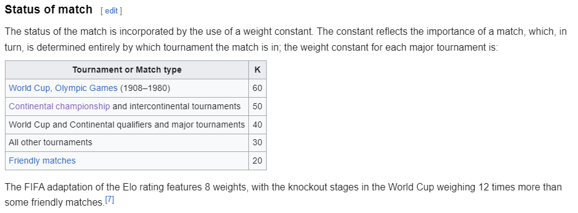
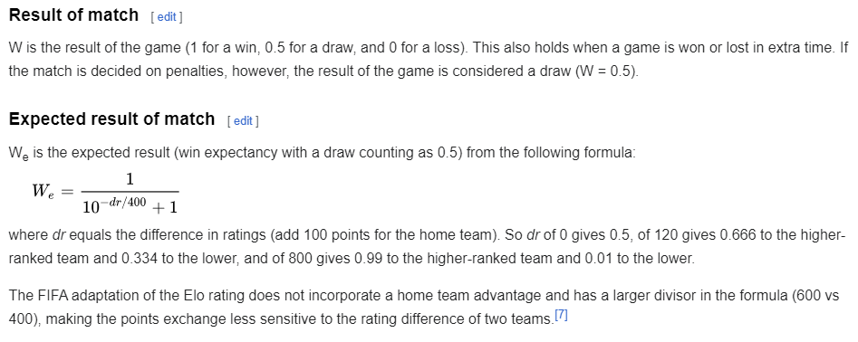
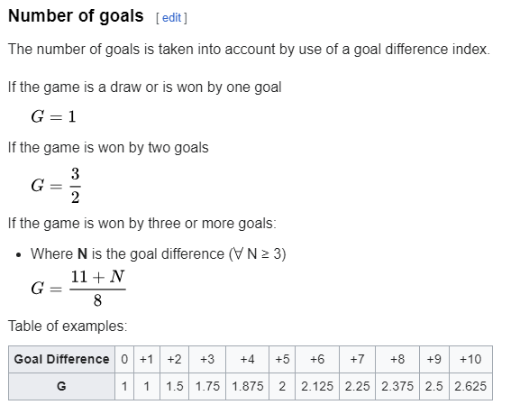
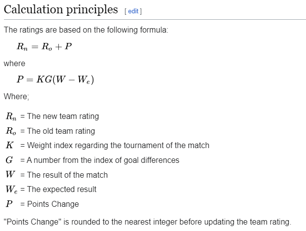

# EURO 2024 Machine Learning Match Predictor

This repository contains code to predict the outcomes of EURO 2024 football matches using a machine learning model trained with XGBoost. The model is trained on historical match data and predicts which team will win each matchup.

Currently the results are available for the group stage matches and more will be available after the knockout stage matchups are set.

[Click here to view the Jupyter Notebook](model.ipynb)

## Overview

The project uses historical match data to train an XGBoost classifier. The features used for training include the Elo ratings of the home and away teams, as well as their attack and defense ratings. The model is then used to predict the outcomes of future matches.

Resourses used to learn the basics of machine learning, and helped with the accomplishing the results of this project are listed below:

**Courses**

- [Coursera Machine Learning Specialization](https://www.coursera.org/specializations/machine-learning-introduction)
- [Kaggle Intro to Machine Learning](https://www.kaggle.com/learn/intro-to-machine-learning)
- [Kaggle Pandas Course](https://www.kaggle.com/learn/pandas)
- [Kaggle Intermediate Machine Learning](https://www.kaggle.com/learn/intermediate-machine-learning)
- [Predict Football using Machine Learning Youtube Video](https://www.youtube.com/watch?v=0irmDBWLrco&pp=ygUrZm9vdGJhbGwgcHJlZGljdGlvbiB1c2luZyBtYWNoaW5lIGxlYXJuaW5nIA%3D%3D)

**Data Sets and Other Information**

- [International Football Results from 1872 to 2024](https://www.kaggle.com/datasets/martj42/international-football-results-from-1872-to-2017/data)
- [Create Your Own Power Rankings](https://footballxg.com/2020/12/22/create-your-own-power-ratings/#:~:text=Attack%20and%20Defence%20Strength&text=This%20is%20simply%20done%20by,scored%20by%20the%20league%20averages.)
- [Continental Football Championships](https://en.wikipedia.org/wiki/Continental_football_championships)
- [Euro predictions using Poisson Distribution](https://www.kaggle.com/code/robertostl/2024-euro-prediction-using-poisson-distribution/notebook)
- [World Football Elo Rankings Wikipedia](https://en.wikipedia.org/wiki/World_Football_Elo_Ratings)
- [World Football Elo Rankings (Eloratings)](https://eloratings.net/about)

**Libraries Used**

- Pandas
- Scikit-Learn
- matplotlib
- xgboost
- Python/Jupyter Notebooks

## Data Preparation

The data collected from the historical matches can be used to feature engineer more accurate data for the model to work with.

## Elo ratings for both teams.

The following formula for calculating the team elo's was gathered from wikipedia, which also references eloratings.net. A similar elo system is used by the international chess federation to rank players. The implementation used for ranking football teams is a modified version of the formula.

### K Value Determination

- The `k_value` function assigns different K values based on the tournament type. Higher K values lead to more significant changes in Elo ratings.

### Expected Result

- The `expected_result` function calculates the expected probability of the home team winning using the difference in Elo ratings between the home and away teams. The formula used is:
  $$
  \text{We} = \frac{1}{10^{-\frac{\text{dr}}{400}} + 1}
  $$
  where \( \text{dr} \) is the difference in Elo ratings (home - away).

### Match Result

- The `match_result` function assigns actual match results: 1 for a win, 0.5 for a draw, and 0 for a loss.

### Goal Index

- The `goal_index` function adjusts the impact of the match result on Elo ratings based on the goal difference.

### Elo Update

The `calculate_elo` function updates the Elo ratings for both teams after a match. The formula used is:

$$
\text{new\_elo} = \text{current\_elo} + K \times g \times (w - \text{We})
$$

where \( K \) is the K value, \( g \) is the goal index, \( w \) is the match result, and \( \text{We} \) is the expected result.

## Attack and defense ratings for both teams.

### Expected Goals

- The expected goals for home and away teams are calculated using the formula:
  $$ \text{{xg\_home}} = \text{{home\_attack}} \times \text{{away\_defense}} \times c $$
  $$ \text{{xg\_away}} = \text{{away\_attack}} \times \text{{home\_defense}} / c $$
  where \( c \) accounts for the home team advantage.

### Ratings Update

- The `calculate_attack_defense` function updates the attack and defense ratings for both teams. The formula used is:
  $$ \text{{new\_attack}} = \text{{current\_attack}} + \frac{K}{2000} \times (\text{{actual\_goals}} - \text{{expected\_goals}}) $$
  $$ \text{{new\_defense}} = \text{{current\_defense}} + \frac{K}{2000} \times (\text{{actual\_goals\_conceded}} - \text{{expected\_goals\_conceded}}) $$

## Machine Learning Predictions

### Feature Preparation

- Features such as Elo ratings, attack, and defense ratings before the match are used to train an XGBoost classifier.

### Model Training

- The model is trained to predict the match result based on the features.

### Prediction

- The model predicts the probability of each possible match outcome (home win, away win, draw), and the most likely outcome is selected.

## Points Calculation

### Points Assignment

- Points are assigned based on the predicted outcomes of matches (3 points for a win, 1 point for a draw, 0 points for a loss).

### Standings Calculation

- The total points for each team are calculated and grouped by their respective groups to determine standings.
